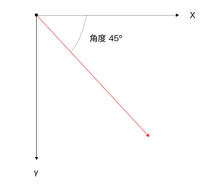
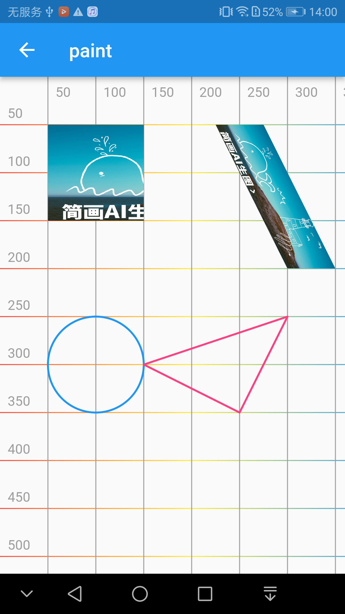
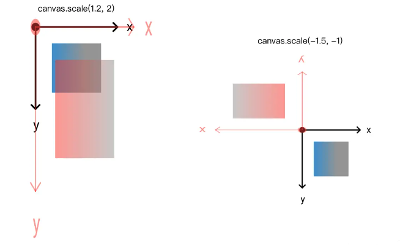
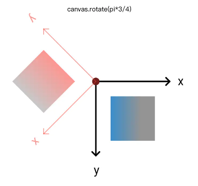
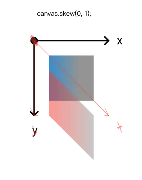
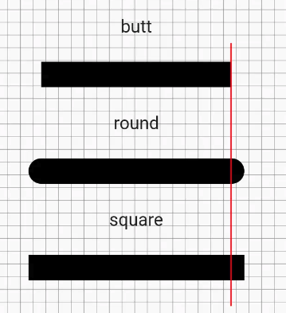
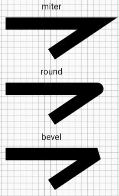
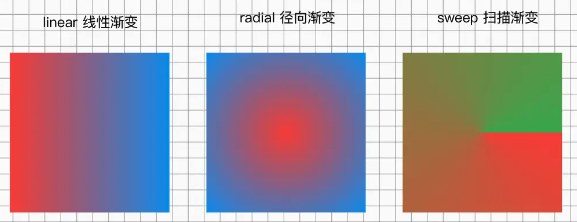
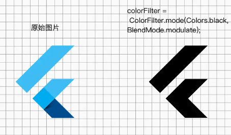

# 基本概念

1. 坐标系统：Flutter使用笛卡尔坐标系来确定绘制的位置。原点（0, 0）位于Canvas的左上角，x轴向右延伸，y轴向下延伸。可以使用坐标系统来定位和变换绘制对象的位置。

2. Canvas（画布）：Canvas是Flutter绘图的核心概念之一，它提供了一个绘制区域，可以在其中进行绘制操作。在Canvas上可以绘制各种图形、文本和图像。

3. Paint（画笔）：Paint用于定义绘制的样式和属性，如颜色、线条宽度、透明度等。通过设置Paint的属性，可以实现各种绘制效果。

4. Path（路径）：Path是一系列直线和曲线的集合，用于定义图形的形状。可以通过Path绘制直线、曲线、矩形、圆形等复杂的图形。

5. 绘制流程：在Flutter中，绘制操作是在每个帧（frame）上执行的。Flutter的渲染引擎将绘制命令发送给硬件加速的绘图API，并将结果显示在屏幕上。绘制流程通常包括创建Canvas对象、设置Paint属性、绘制图形和释放资源等步骤。

6. 图层（Layers）：Flutter使用图层来管理绘图对象。每个图层都有自己的绘制操作和属性，它们可以组合和嵌套，形成复杂的绘制结构。图层可以提高绘制的性能和效率。

7. 绘制优化：为了提高绘制的性能和效率，Flutter提供了一些优化技术，如局部重绘（Partial Redraw）、图层缓存（Layer Caching）、裁剪（Clipping）等。这些技术可以减少不必要的绘制操作，提高应用程序的响应性和流畅性。

## 坐标系

Flutter 中坐标系是当前画布的左上角为原点，向左为 x 轴正向，向下为 y 轴正向。角度是弧度制，以距离原点水平位置右侧为 0 度，顺顺时针方向。即 pi 为原点左侧水平方向。



## Canvas（画布）

Canvas（画布）是Flutter中用于绘制图形、文本和图像的核心概念。它提供了一个绘制区域，你可以在其上执行各种绘制操作来创建自定义的UI元素和图形效果。

### 创建Canvas

#### 1. CustomPaint创建Canvas对象

CustomPaint 是一个用于自定义绘制的 Flutter 组件，它可以接收一个画布（Canvas）作为参数，并在其中进行绘制操作。通过自定义 CustomPaint 组件，可以在其绘制回调方法中创建 Canvas 对象。

```Dart
CustomPaint(
  painter: MyCustomPainter(), // 自定义的绘制器，继承自 CustomPainter
  child: Container(
    // 子组件
  ),
)

// 需要重写 CustomPainter 的 paint 方法，在该方法中可以获取 Canvas 对象
class MyCustomPainter extends CustomPainter {

  @override
  void paint(Canvas canvas, Size size) {
    // 在 canvas 上进行绘制操作
    // ...
  }

  @override
  bool shouldRepaint(CustomPainter oldDelegate) {
    return false; // 控制是否需要重绘
  }
}
```

#### 2. 使用 CustomPaintWidget创建Canvas

如果只需要简单地绘制一些形状或图像，可以使用 CustomPaintWidget 组件。它接收一个回调函数作为参数，该回调函数接收一个 Canvas 对象，并在其中进行绘制操作。

```Dart
CustomPaintWidget(
  painter: (canvas, size) {
    // 在 canvas 上进行绘制操作
    // ...
  },
  child: Container(),
)
```

### canvas 的绘制能力

Canvas 在 Flutter 中具有强大的绘制能力，可以实现各种形状、图像和文本的绘制。以下是 Canvas 的一些常用绘制能力：

1. 绘制形状：Canvas 可以绘制各种形状，如线条、矩形、圆形、椭圆等。通过调用 Canvas 的绘制方法，可以指定形状的位置、大小、颜色、边框等属性来进行绘制。

2. 绘制路径：Canvas 支持绘制自定义路径，可以通过添加直线段、曲线段等路径操作来构建路径。绘制路径可以用于创建复杂的形状和轮廓，并可以应用渐变、阴影等效果。

3. 绘制图像：Canvas 可以绘制图像，包括位图和矢量图像。通过使用 ImageProvider 或 Picture 绘制图像，可以在 Canvas 上呈现图像，并可以进行缩放、裁剪和变换等操作。

4. 绘制文本：Canvas 可以绘制文本，包括单行文本和多行文本。可以指定文本的字体、大小、颜色、对齐方式等属性，并可以应用样式效果，如描边、阴影等。

5. 绘制渐变：Canvas 支持绘制线性渐变和径向渐变。通过指定渐变的起始点、终点、颜色和渐变类型，可以在 Canvas 上创建平滑的渐变效果。

6. 绘制阴影：Canvas 可以绘制形状和图像的阴影效果。通过设置阴影的颜色、模糊半径和偏移量，可以为绘制对象添加逼真的阴影效果。

7. 绘制混合模式：Canvas 支持使用混合模式来控制绘制对象的叠加效果。可以通过设置绘制对象的混合模式，实现透明度、遮罩、颜色混合等效果。

8. 绘制动画：Canvas 可以与动画结合使用，实现平滑的动画效果。通过在每一帧中更新绘制对象的属性，可以创建流畅的过渡和变换效果。

效果展示：



裁剪

```
canvas.clipRect(const Rect.fromLTWH(0, 50, 100, 100));
```

路径

```
    Path path = Path()
      ..moveTo(150, 300)
      ..lineTo(250, 350)
      ..lineTo(300, 250)
      ..close();
    canvas.drawPath(path, paint);
```

#### 变换

Canvas 提供了4种变换操作，位移、旋转、缩放、斜切。

##### 坐标系：

Flutter 中坐标系是当前画布的左上角为原点，向左为 x 轴正向，向下为 y 轴正向。角度是弧度制，以距离原点水平位置右侧为 0 度，顺顺时针方向。即 pi 为原点左侧水平方向。


##### 位移 translate

```
void translate(double dx, double dy
```

移动画布原点到指定的位置，`dx`和`dy`可以为负数


##### 缩放 scale

```
void scale(double sx, [double? sy])
```

缩放操作,`sx`和`sy`分别是x轴和y轴方向上的缩放比例 ，如果未指定sy ，则sx将用于两个方向的比例。`sx`和`sy`可以为负数，为负数时会产生对向旋转的效果。



##### 旋转 rotate

```
void rotate(double radians)
```

以原点为中心旋转画布，`radians`:旋转角度，弧度制，即 pi=180º



##### 斜切 skew

```
void skew(double sx, double sy)
```

延x或y轴方向做斜切的变换，`sx`和`sy` 为x轴和y轴方向切度值，值为三角函数中的 `tan` 值，即 `45` 度时 tan 值为 `1` 。



##### save 和 restore

用于保存和恢复绘图状态，这些方法常用于绘制操作中的状态管理，可以保留当前的绘制状态并在后续操作后恢复到之前的状态。

1. `save()` 方法：
   
   - `save()` 方法用于保存当前的绘图状态，并将其入栈。在调用 `save()` 方法之后的绘制操作将会在新的绘图状态下进行。这意味着后续的变换、颜色设置、剪裁等绘图操作都将只影响到新的绘图状态，而不会影响之前保存的状态。
   - `save()` 方法没有参数，调用时直接保存当前的绘图状态。
   - `save()` 方法返回一个整数值，代表当前保存状态在栈中的索引，用于后续的 `restore()` 方法调用时使用。

2. `restore()` 方法：
   
   - `restore()` 方法用于恢复之前保存的绘图状态。它会将绘图状态栈中的最顶层状态弹出，并将当前状态恢复为弹出的状态。
   - `restore()` 方法可以没有参数调用，它会弹出并恢复最顶层的绘图状态。也可以传入先前调用 `save()` 方法返回的索引，以恢复特定的绘图状态。
   - 如果绘图状态栈为空或索引无效，则会抛出异常。

通过 `save()` 和 `restore()` 方法的配合使用，可以实现以下效果：

- 在 `save()` 和 `restore()` 之间的绘制操作只会影响到这个范围内的绘图状态，不会影响到之前的状态。
- 可以在绘制操作过程中多次调用 `save()` 方法，每次调用都会将当前状态保存到栈中，形成一个绘图状态的层次结构。
- 可以通过多次调用 `restore()` 方法逐级恢复之前保存的状态，回到先前的绘图状态。

示例代码：

```
    canvas.save();
    canvas.scale(0.5, 0.5);
    canvas.rotate(pi / 2);
    canvas.skew(0, -0.5);
    if (image != null) {
      final src = Rect.fromLTWH(
          0, 40, image!.width.toDouble(), image!.height.toDouble() - 80);
      const dst = Rect.fromLTWH(100,-400, 300, 100);
      canvas.drawImageRect(image!, src, dst, Paint());
    }
    canvas.restore();
```

## Paint（画笔）

Paint用于定义绘制的样式和属性，如颜色、线条宽度、透明度等。通过设置Paint的属性，可以实现各种绘制效果。

#### 属性

```
  var paint = Paint()
    ..maskFilter = MaskFilter.blur(BlurStyle.normal, 0)
    ..color = Colors.black
    ..colorFilter = ColorFilter.linearToSrgbGamma()
    ..invertColors = true
    ..shader = ui.Gradient.linear(Offset.zero, Offset(100, 0), [Colors.black, Colors.white])
    ..strokeMiterLimit = 0
    ..strokeJoin = StrokeJoin.bevel
    ..strokeWidth = 10
    ..isAntiAlias = true
    ..strokeCap = StrokeCap.round
    ..style = PaintingStyle.stroke
    ..blendMode = BlendMode.clear
    ..filterQuality = FilterQuality.high
    ..imageFilter = ColorFilter.srgbToLinearGamma();
```

#### 常用属性介绍

##### `isAntiAlias` : 抗锯齿

是否对画布上绘制的线条和图像应用抗锯齿，默认`true`

##### `strokeWidth` : 线条宽度

当style设置为PaintingStyle.stroke时绘制边缘的宽度，默认 `0.0`

##### `style` : 填充效果

- `PaintingStyle.stroke` : 将Paint应用到形状的边缘
- `PaintingStyle.fill` : 将Paint在形状的内部

##### `strokeCap` :端点类型

- `butt`: 平头
- `round`: 圆头
- `square`: 方头
  当style设置为PaintingStyle.stroke时，在绘制的线条末端放置的类型。默认为StrokeCap.but  
  同样的绘制线条，round 和 square 比 butt 多出一些，多出的长度为 strokeWidth 的一半



##### `strokeJoin` : 拐角的形状

- `miter`: 尖角
- `round`: 圆角
- `bevel`: 斜角  
  适用于style设置为PaintingStyle.stroke时绘制的路径，不适用于使用Canvas.drawPoints绘制为线条的点。 默认为StrokeJoin.miter ，即尖角



##### `shader` : 设置渐变和图片着色器

- `linear`: 线性渐变
- `radial`: 径向渐变
- `sweep`: 扫描渐变  
  在 dart.ui.Gradient 下提供了三种命名构造函数，方便快速的构建渐变



##### `colorFilter`：着色器

colorFilter 更多的用在处理图片颜色上



## Path（路径）

Path是一系列直线和曲线的集合，用于定义图形的形状。可以通过Path绘制直线、曲线、矩形、圆形等复杂的图形。

```
//移动画笔到指定位置
void moveTo(double x, double y)  
//从当前位置连接一条直线到指定位置
void lineTo(double x, double y)
//添加一个矩形到 path
void addRect(Rect rect)
//添加圆角矩形
void addRRect(RRect rrect)
//添加一个椭圆到 path，如果 Rect 是一个正方形的话，那么添加的会是一个正圆
void addOval(Rect oval)
//添加一个弧线到 path，是弧度制单位
void addArc(Rect oval, double startAngle, double sweepAngle)
//添加其他 path 到当前的 path
void addPath(Path path, Offset offset, {Float64List? matrix4})
//闭合图像
void close()
```


